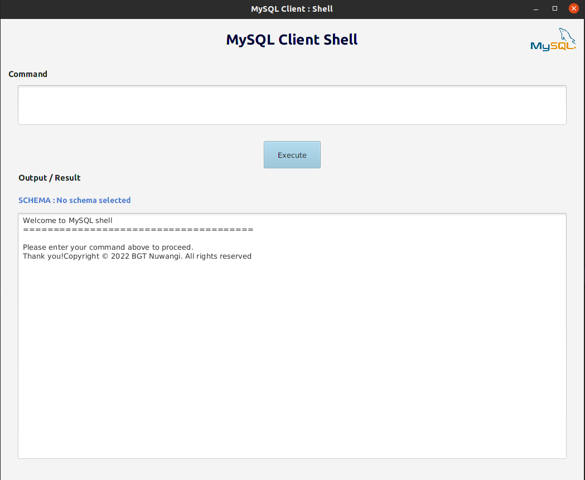
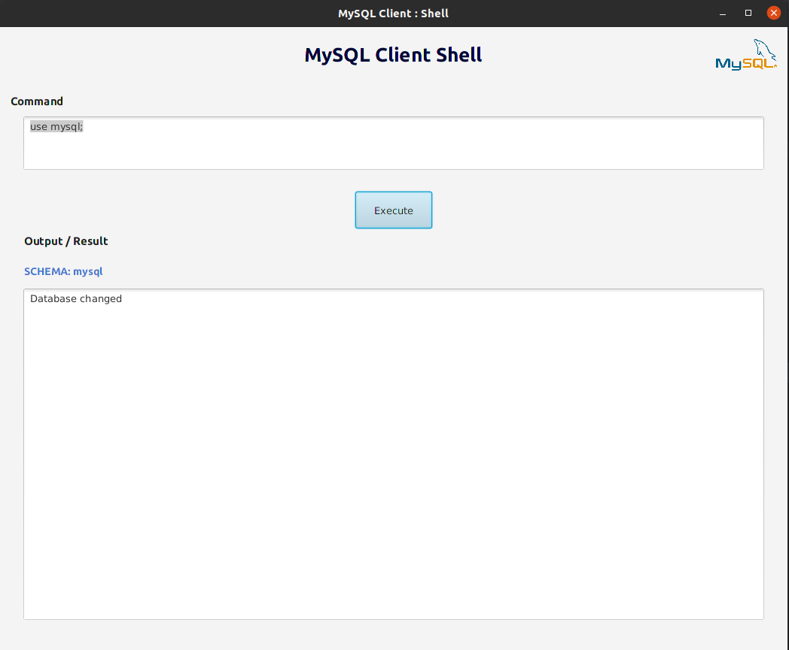

# MySQL Client Shell Application

### The Repository
I have developed this MySQL Client Shell Application to get more knowledge about processes. I have used my knowledge about processes, mysql, java fx and java to develop this application.
The source code is available to everyone under the standard [MIT License](https://choosealicense.com/licenses/mit/).

### License
Copyright © 2022 -  B G Thakshila Nuwangi. All rights reserved.

Licensed under the [MIT License](https://choosealicense.com/licenses/mit/)